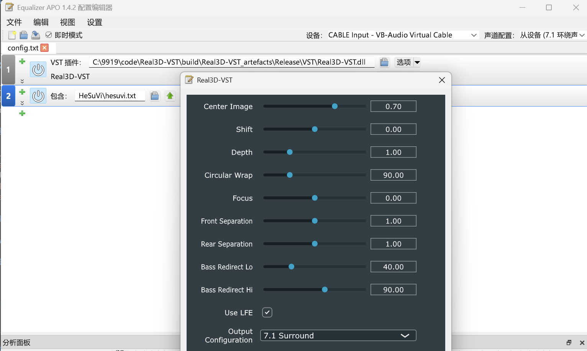

# Real3D-Surround-Upmixer

[中文](#中文) | [English](#english)

---

## 中文

Real3D-VST 是一个专为多通道环绕声上混（Upmixer）设计的音频插件。它基于经典的 FreeSurround 解码算法，旨在将传统的立体声（2.0）音频实时扩展为更加沉浸的多声道（如 5.1 或 7.1）环境。本项目包含跨平台的 VST 插件版本（兼容 Equalizer APO，可与 HeSuVi 搭配使用）以及专为 foobar2000 设计的组件。

[](screenshot.png)
**你可能需要对 HeSuVi 的配置进行额外处理，内置的声道识别与上混可能会冲突**

### 项目结构

- [Source/](Source/): VST 插件核心源代码，基于 C++ 与 JUCE 框架。
- [Real3D-foobar/](Real3D-foobar/): 针对 foobar2000 播放器的 DSP 组件实现。这是一个独立的 Visual Studio 项目，需使用 `.sln` 文件进行编译，不受外层 CMake 构建控制。
- [VST_SDK_2.4/](VST_SDK_2.4/): 提供 VST2 兼容支持的 SDK。
- [CMakeLists.txt](CMakeLists.txt): 跨平台项目构建配置。

### 编译指南

#### VST 插件 (CMake)

1. **环境要求**:
    - **CMake** (版本 3.22 或更高)
    - **JUCE 框架**: 默认路径需位于 `C:/JUCE`（若不同请在 [CMakeLists.txt](CMakeLists.txt) 中配置）。
    - **编译器**:
        - Windows: Visual Studio 2022 (v143)
        - macOS: Xcode
        - Linux: GCC / Clang

2. **编译步骤**:
    ```powershell
    cmake -B build
    cmake --build build --config Release
    ```
3. **输出路径**: 编译成功的二进制文件将位于 `build/Real3D-VST_artefacts/Release/VST` 目录下。

#### foobar2000 组件 (Visual Studio)

1. 进入 [Real3D-foobar/](Real3D-foobar/) 目录。
2. 使用 Visual Studio 打开 `foo_dsp_fsurround.sln`。
3. 选择 `Release` 配置并生成解决方案。

### 重要说明 (Caveats)

- **兼容性测试**: 目前插件仅在 **8声道（7.1环绕声）** Windows 环境下进行了完整测试，其他声道布局（如 5.1）的性能表现可能未经充分验证。
- **第三方库说明**: 本项目引用的 `VST_SDK_2.4` 源自第三方存储库。**如有侵权行为，请告知**
- **代码状态**: 本项目目前的实现包含较多原始或未经深度重构的代码（Experimental/Vibe-driven code），可能存在待优化的部分，欢迎贡献改进建议。

---

## English

Real3D-VST is a specialized audio plugin designed for multi-channel surround sound upmixing. Leveraging the classic FreeSurround decoding algorithm, it aims to expand traditional stereo (2.0) audio into a more immersive multi-channel (e.g., 5.1 or 7.1) experience in real-time. This project includes both a cross-platform VST version (compatible with Equalizer APO and HeSuVi) and a dedicated component for foobar2000.

[](screenshot.png)
**Special handling for HeSuVi configuration may be required, as built-in channel identification and upmixing might conflict.**

### Project Structure

- [Source/](Source/): Core source code for the VST plugin, built with C++ and the JUCE framework.
- [Real3D-foobar/](Real3D-foobar/): DSP component implementation specifically for foobar2000. This is a standalone Visual Studio project; it must be built using its own `.sln` file and is not managed by the top-level CMake configuration.
- [VST_SDK_2.4/](VST_SDK_2.4/): SDK providing backward compatibility for VST2.
- [CMakeLists.txt](CMakeLists.txt): Cross-platform build configuration.

### Build Instructions

#### VST Plugin (CMake)

1. **Prerequisites**:
    - **CMake** (v3.22 or higher)
    - **JUCE Framework**: Expected at `C:/JUCE` by default (configurable in [CMakeLists.txt](CMakeLists.txt)).
    - **Compiler**:
        - Windows: Visual Studio 2022 (v143)
        - macOS: Xcode
        - Linux: GCC / Clang

2. **Steps**:
    ```powershell
    cmake -B build
    cmake --build build --config Release
    ```
3. **Artifacts**: Successfully built plugins will be located in `build/Real3D-VST_artefacts/Release/VST`.

#### foobar2000 Component (Visual Studio)

1. Navigate to the [Real3D-foobar/](Real3D-foobar/) directory.
2. Open `foo_dsp_fsurround.sln` with Visual Studio.
3. Select the `Release` configuration and build the solution.

### Important Notes (Caveats)

- **Testing Status**: The current version has been primarily tested in **8-channel (7.1 Surround)** environments. Compatibility and performance for other layouts (like 5.1) have not been extensively verified yet.
- **Third-party SDK**: The `VST_SDK_2.4` used in this project is sourced from a third-party repository. We respect intellectual property rights; **if there are any copyright concerns, please contact us.**
- **Code Philosophy**: Please note that much of the implementation is currently in an experimental or "vibe-driven" state. While functional, it may contain unpolished sections or require further optimization—your contributions and feedback are highly appreciated.

---

## License

Parts of the code are based on the GPL protocol. See [Real3D-foobar/LICENSE](Real3D-foobar/LICENSE) for details.
